# Nikhil Adlakha — ML Engineer · AI Builder

> Building systems where LLMs stop being demos and start being infrastructure.

Senior ML Engineer at **BlackLine** (FinTech), previously at **Amazon** where I built 0→1 automated patching pipelines and ML-based early warning systems for AWS service reliability. Master's in AI from University of Cincinnati. AWS Certified ML Engineer.

📍 San Francisco Bay Area &nbsp;·&nbsp; 🚀 Open to AI Engineering roles

---

## 🚀 Featured Projects

### [ResoPrism](https://github.com/Nikhil-Ads/ResoPrism)
Multi-agent research assistant built at the **MongoDB Agentic Orchestration Hackathon** (Cerebral Valley, SF). Three specialized agents search grants, papers, and news sources in parallel — coordinated by a LangGraph orchestrator with deterministic ranking and MongoDB Atlas for intelligent result caching. OpenAI handles keyword extraction; the system degrades gracefully when individual agents fail.

`LangGraph` · `MongoDB Atlas` · `OpenAI` · `Python`

### [Time Series Forecast AI Copilot](https://ts-forecasting-copilot.streamlit.app/)
Production-deployed forecasting assistant on Streamlit Community Cloud. Accepts arbitrary time series data and returns forecasts with natural-language explanations — built for analysts who shouldn't need to know what SARIMA is.

`Streamlit` · `Python` · `LLMs` · `Time Series`

### [Cannondale BI Agent](https://cannondale-bi-agent.streamlit.app)
Conversational business intelligence layer over structured product data. RAG pipeline with ChromaDB embeddings, LangGraph for multi-turn memory, GPT-4o-mini for generation. Designed to answer questions a sales rep would actually ask, not just "summarize this table."

`LangGraph` · `ChromaDB` · `GPT-4o-mini` · `Streamlit`

---

## 🌍 Open Source Contributions

- **[Hakadorio](https://github.com/therogue/hakadorio-community)** — Contributing to a local-first task manager with AI-powered task management (Python/FastAPI backend + TypeScript frontend). Built with Anthropic's Claude API for natural language task creation and management.
- **[ResoPrism](https://github.com/Nikhil-Ads/ResoPrism)** — Co-created at the MongoDB Agentic Orchestration Hackathon (Cerebral Valley, SF). Multi-agent research assistant using LangGraph orchestration, OpenAI-powered keyword extraction, and MongoDB Atlas for intelligent caching. Agents search grants, papers, and news in parallel with deterministic ranking.

---

## 🔨 Currently Building

**Job Application Agent** — Fully automated application pipeline using LangGraph, n8n, and OpenClaw on a self-hosted Mac Mini. Reads job postings, tailors resume/cover letter via Claude API, submits — with a human-in-the-loop review step before anything goes out.

**Local AI Infrastructure** — n8n + Ollama + Claude API running on personal hardware. Exploring what changes when inference has no rate limits, no latency overhead, and no per-token cost.

**Content Automation** — LLM pipelines that turn rough notes into polished LinkedIn posts, maintaining voice consistency across drafts.

---

## 🧠 What I'm Exploring

- Long-horizon agentic task execution and failure recovery strategies
- Structured output reliability in production RAG pipelines
- Evaluation frameworks for multi-agent systems (beyond vibes-based testing)
- Foundation model fine-tuning for domain-specific reasoning

---

## 💻 Tech Stack

**AI / ML**
&nbsp;

**Languages & Frameworks**
&nbsp;

**Cloud & Data**
&nbsp;

---

## 📊 GitHub Stats

<table align="center" width="100%">
  <tr>
    <td width="55%" align="center">
      
    </td>
    <td width="45%" align="center">
      
    </td>
  </tr>
  <tr>
    <td align="center">
      
    </td>
    <td align="center">
      
    </td>
  </tr>
</table>

 

